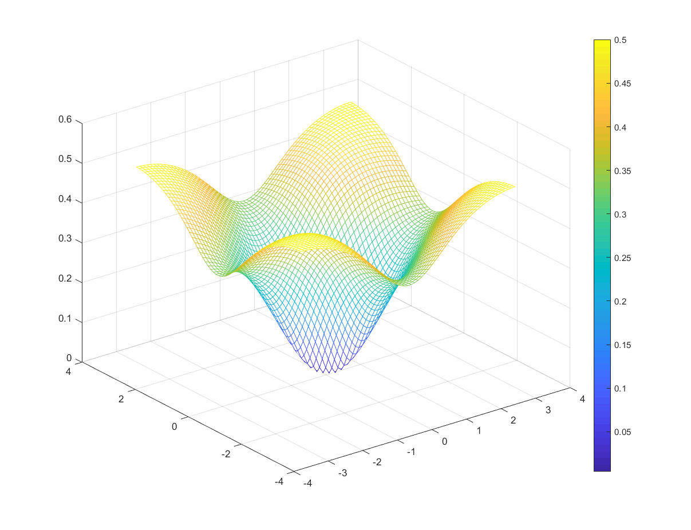

# Deep Multigrid 优化报告


姓名: 王恩泽

学号: 515071910069

班级: F1507104


**摘要:** 本报告包括两部分, 第一部分包括了对算法的介绍和一些其他工作吗; 第二部分对一维的PDE方程进行Multigrid优化, 具体处理的是Helmholtz方程, 并对优化结果和不同情况进行了分析; 第三部分包括对二维的PDE方程的Multigrid优化, 具体处理的是Poisson-Boltzmann方程的线性形式.


## 目录

[TOC]


## 第一部分: 优化算法

### SGD 和 Adam 优化算法

SGD(Stochastic Gradient descent)和它的延伸Adam算法是我们要用到了两个关键的算法, 也是现在神经网络和深度学习方面应用最为广泛的两个优化算法之一, 现在对这两个算法进行介绍:

#### SGD 随机梯度下降方法

考虑一个带参数$w$的目标函数:
$$
Q(w) = \dfrac{1}{n}\sum_{i=1}^{n}Q_i(w)
$$
现在我们的目标就是寻找$w$来找到是$Q(w)$最小.

我们首先想到的就是计算$Q(w)$的梯度$\nabla Q$然后沿着这个梯度下降的方向寻找极小值. 但是在大部分情况, 这个梯度是很难计算的, 比如我们论文中出现的矩阵的谱半径, 有的时候难以计算整体的梯度, 所以我们考虑选取一些$Q_{i}$, 计算它们的梯度, 让这些梯度代替整个函数的梯度.  所以一般的, 随机梯度下降(SGD) 不一定保证误差减少, 因为这些代表函数的梯度方向不一定是整个函数的梯度方向.

##### 算法

选取初始值$w_0$和学习步长$\eta$.

任意选取训练集并训练:
$$
w = w - \eta \nabla Q_i(w)
$$
直到到达要求.

##### 困难

- 选取适合的学习步长
- 学习步长是固定的, 不能随着下降而调整
- 对于非凸的问题不适合


#### Momentum 带动量参数的随机梯度下降方法

基于对第一个困难的思考, 人们发明了带动量的随机梯度下降方法.

##### 算法

选取初始值$w_0$和学习步长$\eta$.

任意选取训练集并训练:
$$
\theta_t = \gamma \theta_{t-1} + \eta \nabla Q_{i}(w) \\
w = w -\theta
$$
这里多出来一个$\gamma\theta_{t-1}$, 也就是说我们现在对$w$的修正不仅仅和现在的梯度相关, 还和过去的梯度相关. 这有点像物理中的惯性的概念, 如果我们发现离目标点很远, 那么我们就会加速, 当我们离目标越来越近, 我们就会减速, 加入了这个类似于加速度的项之后, Momentum算法会比传统的SGD更好, 它的学习步长也能根据过去的资料'学习', 随时改变.

Adam算法是Momentum算法的改进, 原理类似.

所以基于随机梯度下降方法的优化算法不一定使得目标函数不断下降, 考虑整体的梯度和局部梯度的差别, 目标函数有可能会上升.

### Multigrid 方法概述和优化方向

#### Multigrid方法

考虑到读者有一定Multigrid的基础, 所以本文简要陈述Multigrid方法和我们的优化过程.

考虑一个Possion方程, 任何基于FEM和FDM的微分方程方法都能将这个方程的数值问题变为一个求解线性方程的问题:
$$
Au = f
$$
这个线性方程组要么由离散的差分算子产生(FDM), 要么由弱解问题产生(FEM). 总之以上两点都是确定的. 真正值得我们研究的是如何解这个线性方程组, 在矩阵大小不太大的时候, 这个方程组的解是容易得到的, 但如果格点的尺度增加, 矩阵的大小变大, 那么这个线性方程组的解决就变得很困难, 课堂上我们已经介绍了基于fft的快速Possion方法, 而Multigrid方法也是我们经常使用的一种解决该问题的方法. 现在讨论一个two-level Multigrid, 它的思路如下:

首先我们假设上述线性方程组的解是$u_0$.

* 雅可比迭代(Pre-smoothing):
  $$
  INPUT=u_0\\
  M = \omega^{-1}diag(A)\\
  K = M-A\\
  u^{k+1}_{pre} = (M^{-1}K)^su^k+sM^{-1}f\\
  OUTPUT=u_{pre}
  $$
  ​

* 粗网格解方程:
  $$
  INPUT = u_{pre}\\
  r^k = Au_{pre}-f\\
  r^k_c = Rr^k\\
  A_c = RAP\\
  Solve: A_cu^k_c = r^k_c\\
  u^k = u^k_{pre}+Pu^k_c\\
  OUTPUT = u^k
  $$
  ​

* 雅可比迭代(Post-smoothing):

  ​
  $$
  INPUT = u^k\\
  u^{k+1} = (M^{-1}K)^su^k+sM^{-1}f\\
  OUTPUT=u^{k+1}
  $$


所以, two-level Multigrid 总可以写成一个矩阵运算:
$$
u_{k+1} = Cu_{k}+b\\
C = (M^{-1}K)^s(I+P(RAP)^{-1}RA)(M^{-1}K)^s\\
b = ((M^{-1}K)^sP(RAP)^{-1}R(sAM^{-1}-I)+sM^{-1})f\\
$$
上式其实直接引出了这个外循环的Multigrid的形式, 见下图:


$u_k$带入到Multigrid中, 计算出$u_{k+1}$, 不断的往后迭代, 迭代的过程中不断接近真解.

为什么论文中不使用大V Multigrid或者W迭代地Multigrid 呢? 我认为作者式基于一个这样的考虑, 因为我们得到的优化后的$R, P, \omega$是基于这个尺度网格的, 但是不在这个尺度是不知道的, 所以我们只能在这两个网格上进行Multigrid, 如果要到其他尺度地$R, P$ 就要重新优化.

考虑到迭代法运算时, 真解和迭代产生的解满足:
$$
\|u^{k}-u^*\|\leq \rho^k(C)\|u^{0}-u^*\|
$$
所以two level Multigrid 的收敛与否, 收敛的快慢与否, 都取决于矩阵$C$的模长是否小于1, 是否足够的小.

考虑$C$ 的表达式:
$$
C = (M^{-1}K)^s(I+P(RAP)^{-1}RA)(M^{-1}K)^s
$$
所以$\rho(C)$是由$\omega, s, P, R$ 决定的函数. 其中$s$是迭代次数与优化问题并无关系, 所以我们考虑的是这样一个优化问题, 选取合适的$\omega, R, P$ 使得 $C$的谱半径足够小.

#### 同伦优化

Poisson方程的$R, P, \omega$我们都是清楚的, 就是一般的延拓, 限制和$\omega = 2/3$, 这是经过大量实验和理论计算得到的, 现在考虑其他相近的方程, 比如Helmholtz方程, 我们想得到它的$R,P,\omega$, 论文中使用同伦优化的方法, 它的思路是, 考虑$$ M= (1-L)A_0+LA_1$$将 Poisson的$R, P, \omega$带入, 用一个优化算法使得对于$M$的$\rho(C_M)$变小, 然后将$M$再往$A_1$方向靠近, 再进行优化, 直到$M = A_1$.

它的算法如下:

Input: discrete Poisson operator: $A_0$, discrete Poisson operator $A_1$, $L = 0$, $\delta$, $ R_0$, $P_0$, $\omega_0$ for $A_0$, accept rate $\tau$

$$M = (1 - L)A_0+LA_1$$

​	当$$L<1$$:

​		通过优化算法, 得到$R_{new}, P_{new}, \omega_{new}, \rho(C_{new})$

​		如果$\rho(C_{new}) < \tau$:

​			令$$R_{0} = R_{new}, P_{0} = P_{new}, \omega_{0} = \omega_{new}$$

​			$$L = L+\delta, M = (1 - L)A_0+LA_1$$

​		如果$\rho(C_{new}) > \tau$:

​			$$\delta = \dfrac{\delta}{2}$$


第二个判断式的意思是如果我们的谱半径大于要求的谱半径, 那么我们必须让步长减小, 使得M与上一个M足够接近.


####  一些问题的考察

在真正优化之前还有一些问题需要我们先考察.


##### 雅可比迭代次数s是否会改变C的谱半径?

先考察Possion算子得$C$得谱半径是否和雅可比迭代次数$s$是否有关系.


|  s   | grid size | $\rho(C)$ |
| :--: | :-------: | :-------: |
|  1   |     2     |  1.76942  |
|  2   |     2     | 0.196603  |
|  3   |     2     |  0.02184  |
|  4   |     2     |  0.00242  |
|  1   |     3     |  1.94024  |
|  2   |     3     |  0.21558  |
|  3   |     3     |  0.02395  |
|  4   |     3     |  0.00266  |

可见在相同grid size 下, s 越大, $C$ 的谱半径越小.


##### 考察谱半径与矩阵模长的关系

在实际计算中, 谱半径得计算是难以操纵的, 尤其将它作为优化算子的一部分, 所以在实际操作中, 我们一般使用矩阵模长代替谱半径, 即Gelfand公式:


$$
\rho(C) = \lim_{k \rightarrow \infin}\|C^k\|^{1/k}\leq\|C\|
$$
上述公式中的模长可以为任意模长.

一般的:
$$
\|C\|_{max}\leq\|C\|_{2}\leq\|C\|_{F}
$$
但在数值计算中我们极少使用max-norm, 因为在优化问题中很不方便.

考察雅可比迭代次数是2次, 不同类型模长和谱半径的关系:

|     $\rho(C)$      |       2-norm        |   Frobenius norm    |
| :----------------: | :-----------------: | :-----------------: |
| 0.2155827617154415 | 0.21833053585561854 | 0.38638228035873634 |

可见不同矩阵半径对于谱半径的预测程度.


## 第二部分: 一维情况的Multigrid优化

### Poisson方程的同伦优化

考虑到上一小节绝对优化的问题, 我们考虑将优化过程分为细小的步骤, 每一个细小的步骤都是一个局部优化问题, 假如局部优化后的结果大于我们设定的accept_radius, 那么算法将重置, 减少与上一次步骤的距离并重来, 保证优化算法的稳定性. 雅可比迭代次数设置为3.


```python
import numpy as np
import tensorflow as tf
import matplotlib.pyplot as plt

from basicpossion import *
from spectralradius import *
from norm import *
from local_optimizer import *
from homotopy_optimizer_Possion import *

m = 1
s = 3
m, GMMradius, DMMradius = radiusPlot(m, s)
print(m)
print(GMMradius)
print(DMMradius)

```


考察不同Grid Size的情况, GMM Radius是未经过优化的谱半径, DMM Radius 是经过优化后的谱半径.

可能优化后的谱半径还是大于1的, 但是我们主要考察能否使谱半径变小, 所以这次实验先不考虑谱半径是否大于1.

| Grid Size | GMM Radius | DMM Radius |
| --------- | ---------- | ---------- |
| 1         | 1.20167    | 0.97665    |
| 2         | 1.76942    | 1.42296    |
| 3         | 1.94024    | 1.69232    |
| 4         | 1.98492    | 1.87570    |
| 5         | 1.99622    | 1.86707    |

可见由于我们有accept-radius,  优化的过程使得谱半径不会超过accpet-radius.


### Possion方程优化的应用

既然我们已经验证了优化的理论可行性, 现在我们实际解一个方程来看看效果.

我们在grid size = 8, 雅可比迭代次数s = 2, 解方程:
$$
-\Delta u = f = (3x+x^2)\exp(x), \quad u(0) =  u(1) = 0
$$
即数值解HW4的题目, 解析解为
$$
u(x) = x(1-x)\exp(x)
$$


```python
import numpy as np
import tensorflow as tf
import matplotlib.pyplot as plt

from basicpossion import *
from spectralradius import *
from norm import *
from local_optimizer_Adam import *
from homotopy_optimizer_Possion import *
from multigrid_two_level import *
m = 8
u_real = lambda x: x*(1-x)*np.exp(x)
f = lambda x: (3*x+x**2)*np.exp(x)
s = 2
GMM_OUTPUT = Multigrid_circle(m, Possion(m), interpolate(m), restriction(m), s, 2/3,  f, 20)
R, P, w, GMMradius, DMMradius = Local_optimizer_Adam(m,Possion(m), interpolate(m), restriction(m), 2/3, 50, 100)
GMMradius = RadiusNumpy(m, Possion(m), interpolate(m), restriction(m), 2/3, s)
DMMradius = RadiusNumpy(m, Possion(m), P, R, w, s)
DMM_OUTPUT = Multigrid_circle(m, Possion(m), P, R, s, w, f, 20)
X = np.linspace(0,1,len(GMM_OUTPUT))
REAL_OUTPUT = u_real(X)
plt.figure(1);
plt.plot(X, GMM_OUTPUT, label = 'GMM_OUTPUT');
plt.plot(X, DMM_OUTPUT, label = 'DMM_OUTPUT');
plt.plot(X, REAL_OUTPUT, label = 'Real_OUTPUT');
plt.legend(loc='upper left');
plt.show();
print(GMMradius)
print(DMMradius)
```

得到结果


|                 |         GMM         |         DMM         |
| :-------------: | :-----------------: | :-----------------: |
| spectral radius | 0.22221566028541073 | 0.22221566028541043 |


DMM和GMM结果类似, 因为Poisson方程Multigrid 所使用的$P, R, \omega$效果都是很好的.


### R, P的自由度

关于R, P, 我们实际上有四个值, 其中两个是一般的R, P, 也就是正常的插值, 另外两个是经过优化之后的R, P. 现在我们考察四个的自由度, 也就是使用形如$(0,0,0,...0,1,0,...0,0,0)$ 的向量作用上去.

```python
import numpy as np
import tensorflow as tf
import matplotlib.pyplot as plt

from basicpossion import *
from spectralradius import *
from norm import *
from local_optimizer_Adam import *
from homotopy_optimizer_Possion import *
from multigrid_two_level import *

m = 8
s = 20
R0, P0, w, GMMradius, DMMradius = Local_optimizer_Adam(m,Possion(m), interpolate(m), restriction(m), 2/3, s, 20)
Raw_Restriction = restriction(m)
Raw_Interpolate = interpolate(m)
Optimized_Restriction = R0
Optimized_Interpolate = P0


print('----------------------------------Raw_Restriction----------------------------------')
n = Raw_Restriction.shape[1];
for i in range(n):
    X = np.zeros([n,1]);
    X[i] = 1;
    OUTPUT = np.dot(Raw_Restriction,X);
    U = np.linspace(0,1,len(OUTPUT));
    print('X is');
    print(X);
    print('OUTPUT is');
    print(OUTPUT);
    plt.figure(1)
    plt.plot(U, OUTPUT,label='Raw_Restriction');
    plt.xlabel('u')
    plt.ylabel('OUTPUT')
    plt.legend(loc='upper left')
    plt.show()
print('----------------------------------Raw_Interpolate----------------------------------')
n = Raw_Interpolate.shape[1];
for i in range(n):
    X = np.zeros([n,1]);
    X[i] = 1;
    OUTPUT = np.dot(Raw_Interpolate,X);
    U = np.linspace(0,1,len(OUTPUT));
    print('X is');
    print(X);
    print('OUTPUT is');
    print(OUTPUT);
    plt.figure(1)
    plt.plot(U, OUTPUT,label='Raw_Interpolate');
    plt.xlabel('u')
    plt.ylabel('OUTPUT')
    plt.legend(loc='upper left')
    plt.show()

print('----------------------------------Optimized_Restriction----------------------------------')
n = Optimized_Restriction.shape[1];
for i in range(n):
    X = np.zeros([n,1]);
    X[i] = 1;
    OUTPUT = np.dot(Optimized_Restriction,X);
    U = np.linspace(0,1,len(OUTPUT));
    print('X is');
    print(X);
    print('OUTPUT is');
    print(OUTPUT);
    plt.figure(1)
    plt.plot(U, OUTPUT,label='Optimized_Restriction');
    plt.xlabel('u')
    plt.ylabel('OUTPUT')
    plt.legend(loc='upper left')
    plt.show()
print('----------------------------------Optimized_Interpolate----------------------------------')
n = Optimized_Interpolate.shape[1];
for i in range(n):
    X = np.zeros([n,1]);
    X[i] = 1;
    OUTPUT = np.dot(Optimized_Interpolate,X);
    U = np.linspace(0,1,len(OUTPUT));
    print('X is');
    print(X);
    print('OUTPUT is');
    print(OUTPUT);
    plt.figure(1)
    plt.plot(U, OUTPUT,label='Optimized_Interpolate');
    plt.xlabel('u')
    plt.ylabel('OUTPUT')
    plt.legend(loc='upper left')
    plt.show()
```

#### 未经优化的R, P

以下在grid size = 5 的时候讨论.

未经优化的R, P形如:
$$
R = \begin{pmatrix} 1/4 &1/2&1/4\\ & & 1/4&1/2&1/4\\&&&&1/4 &1/2&1/4
\end{pmatrix}\\
P = \begin{pmatrix} 1/2&&\\1&&\\1/2&1/2&\\&1&\\&1/2&1/2\\&&1\\&&1/2
\end{pmatrix}\\
$$
所以将它们作用在$(0,0,0,...0,1,0,...0,0,0)$ 的结果是十分规则的比如:


#### 经过优化的R, P

但是经过优化之后的$R, P$ 就不是简单的插值矩阵, 而是每一项都有:

它们输出的结果形如:

```
[[-3.88395493e-14]
 [-5.82593239e-14]
 [ 5.00000000e-01]
 [-7.66570051e-14]
 [-7.56349117e-14]
 [-5.49375204e-14]
 [-2.75965219e-14]]
```


```
[[ 4.12632057e-26]
 [ 1.27761675e-16]
 [-2.55523350e-16]
 [ 2.55523350e-15]
 [-4.85494366e-15]
 [ 1.07319807e-14]
 [ 5.00000000e-01]
 [ 1.00000000e+00]
 [ 5.00000000e-01]
 [ 1.07319807e-14]
 [-4.85494366e-15]
 [ 2.55523350e-15]
 [-2.55523350e-16]
 [ 1.27761675e-16]
 [ 4.12640850e-26]]
```


结果与未经优化的很像, 但是数值上还是有区别的.


### Helmholtz方程的收敛分析

我们先使用课上学到的分析误差收敛发看一下高斯赛德尔迭代和SOR迭代对kmax产生了什么效果.

考虑SOR迭代的误差迭代式:
$$
\varepsilon^{k}_{j-1, l}+\varepsilon^{k+1}_{1, l-1}+\varepsilon^{k}_{j, l+1}+\varepsilon^{k}_{j+1, l}+(-4+k^2h^2)\omega^{-1}\varepsilon^{k+1}_{j, l}+(-4+k^2h^2)(\omega^{-1}-1)\varepsilon^{k}_{j, l}=0
$$
傅里叶变化之后就是:
$$
p^{k+1}(\exp(i\phi)+\exp(i\theta)+(-4+k^2h^2)\omega^{-1}+p^{k}(\exp(-i\phi)+\exp(-i\theta)+(-4+k^2h^2)(\omega^{-1}-1)) = 0
$$
所以:
$$
\dfrac{p^{k+1}}{p^{k}} = \dfrac{|\exp(-i\phi)+\exp(-i\theta)+(-4+k^2h^2)(\omega^{-1}-1)|}{|\exp(i\phi)+\exp(i\theta)+(-4+k^2h^2)\omega^{-1}|}
$$
取$k=200, \omega = 1, h=1/511$, 画图:

```matlab
w = 1;
k = 200;
h=1/511;

[X,Y] = meshgrid(-pi:0.1:pi);
Z = abs(exp(-1i*X)+exp(-1i*Y)+(-4+(k*h)^2)*(1/w-1))./abs((-4+(k*h)^2)/w+exp(1i*X)+exp(1i*Y));
figure
mesh(X,Y,Z);
```


可见最高处已经超过了1, 也就是说如果将Helmholtz方程带入高斯赛德尔中迭代, 误差是有爆破的可能的. 

看看将$\omega=2/3$的情况.


最大值小于1,可见有效果. 

但是调大kmax至800, 误差又不能收敛了.


而且最大值还不一定在最大点取到, 比如kmax=850:


总的来说,这个方程的最大值不是那么好分析的.

相同的kmax, 为了使误差收敛, 调大h变大就行, 比如h=1/10000.




#### Helmholtz方程的优化

现在我们考虑论文中的例子, 考虑方程:
$$
-\dfrac{d^2u(x)}{dx^2}-k^2(x)u(x) = f(x), \quad  u(0) = u(1) = 0
$$
$k(x)$是分段函数:
$$
k(x) = \left\{
\begin{aligned}
1& \quad 0\leq x \leq 0.5\\
\\
k_{max}& \quad 0.5<x\leq 1) 
\end{aligned}
\right.
$$


一般的, 正常的Poisson 算子是这样的:


而Helmholtz算子是这样的:


而我们的算法就是为了设计下面这个算子所需要的R, P.

所以我们在优化的时候要考虑$k_{max}$的不同.

我们先考虑在迭代次数s=2, grid size=8的时候, $k_{max}$从0增加到200时GMM产生的谱半径.

```python
import numpy as np
import tensorflow as tf
import matplotlib.pyplot as plt

from basicpossion import *
from spectralradius import *
from norm import *
from local_optimizer_Adam import *
from homotopy_optimizer_Helmholtz import *

m=8
kmax=np.linspace(0,200,20)
Radius=np.zeros([20,1])
for i in range(20):
        Radius[i] = RadiusNumpy(m, Helmholtz(m, kmax[i]), interpolate(m), restriction(m), 2/3, 2)

plt.figure(1);
plt.plot(kmax, Radius);
plt.show();

```

得到的结果:


可见在kmax150和175之间有一个谱半径峰值, DMM主要针对的就是那里.

现在我们把雅可比迭代的次数调整为$s=2$, 在grid size = 8的尺度下分析不同kmax 在不同的情况下, DMM和GMM的表现.

| kmax | radius of GMM | radius of DMM |
| :--: | :-----------: | :-----------: |
|  0   |    0.22221    |    0.11115    |
|  5   |    0.22224    |    0.11118    |
|  10  |    0.22254    |    0.11124    |
|  15  |    0.22245    |    0.11132    |
|  20  |    0.22265    |    0.11140    |
|  25  |    0.22291    |    0.11162    |
|  30  |    0.22352    |    0.11165    |
|  35  |    0.23119    |    0.11187    |
|  40  |    0.22402    |    0.11207    |
|  45  |    0.22450    |    0.11233    |
|  50  |    0.22574    |    0.11263    |
|  55  |    0.22966    |    0.11303    |
|  60  |    0.39096    |    0.11333    |
|  65  |    0.22706    |    0.11361    |
|  70  |    0.22913    |    0.11402    |
|  75  |    0.23349    |    0.11446    |
|  80  |    0.24825    |    0.11522    |
|  85  |    0.23089    |    0.11547    |
|  90  |    0.23379    |    0.11620    |
|  95  |    0.23895    |    0.11645    |
| 100  |    0.25074    |    0.13017    |
| 105  |    0.30545    |    0.12025    |
| 110  |    0.23981    |    0.11833    |
| 115  |    0.24599    |    0.11880    |
| 120  |    0.25777    |    0.12804    |
| 125  |    0.28933    |    0.12096    |
| 130  |    0.67700    |    0.12271    |
| 135  |    0.25475    |    0.12661    |
| 140  |    0.26747    |    0.12486    |
| 145  |    0.29473    |    0.12606    |
| 150  |    0.39631    |    0.12709    |
| 155  |    0.26547    |    0.12757    |
| 165  |    0.27974    |    0.13604    |
| 170  |    0.30684    |    0.13396    |
| 175  |    1.28115    |    0.13103    |
| 180  |    0.29484    |    0.13595    |
| 185  |    0.32377    |    0.13525    |
| 190  |    0.38951    |    0.13570    |
| 195  |    0.69677    |    0.14516    |
| 200  |    0.31325    |    0.14194    |

我们把两者产生的谱半径和单位半径, accept_radius做成图表:


可见在峰值处, GMM的谱半径大于1, 但是DMM由于优化, 始终低于accept radius.

但是后来事实证明, Helmholtz方程再kmax过大的时候, 即使使用DMM也不能使解收敛.

#### Helmholtz方程优化的应用

现在我们在grid size = 8 上尝试解一下Helmholtz方程.

取kmax=50, s=2

```python
import numpy as np
import tensorflow as tf
import matplotlib.pyplot as plt

from basicpossion import *
from spectralradius import *
from norm import *
from local_optimizer_Adam import *
from homotopy_optimizer_Helmholtz import *
from multigrid_two_level import *

m = 8
s2 = 20
kmax = 50


def f(x): return np.exp(np.pi*x)

NUM_EPOCH = 20
m, GMMradius, DMMradius, R0, P0, w0 = radiusPlot(m, 20, kmax, 5)
GMM_OUTPUT = Multigrid_circle(m, Helmholtz(m, kmax), interpolate(m), restriction(m),2, 2/3,  f, NUM_EPOCH)
DMM_OUTPUT = Multigrid_circle(m, Helmholtz(m, kmax), P0, R0, 2, w0,  f, NUM_EPOCH)

X = np.linspace(0, 1, len(GMM_OUTPUT))
plt.figure(1)
plt.plot(X, GMM_OUTPUT, label='GMM_OUTPUT')
plt.plot(X, DMM_OUTPUT, label='DMM_OUTPUT')
plt.legend(loc='upper left')
plt.show()
print(GMMradius)
print(DMMradius)

```

得到结果:


|                 | GMM     | DMM     |
| --------------- | ------- | ------- |
| spectral radius | 0.22574 | 0.15014 |

取kmax=100, s=2


|                 | GMM     | DMM     |
| --------------- | ------- | ------- |
| spectral radius | 0.25074 | 0.24852 |

取kmax=150, s=2


kmax=175


### 对于优化过后的P, R

考虑优化过后的P和R.

```python
import numpy as np
import tensorflow as tf
import matplotlib.pyplot as plt
from basicpossion import *
from spectralradius import *
from norm import *
from local_optimizer_Adam import *
from homotopy_optimizer_Helmholtz import *
from multigrid_two_level import *
```

```python
m = 8
kmax = 100
def f(x): return np.exp(np.pi*x)
```

```python
m, GMMradius, DMMradius, R0, P0, w0 = radiusPlot(m, 2, kmax, 5)
```

```python
print(GMMradius)
```

```
0.25074765958005774
```

```python
print(DMMradius)
```

```
0.19221522097271113
```

```python
[a,b] = P0.shape
print(a)
print(b)
import xlwt
workbook = xlwt.Workbook() 
sheet = workbook.add_sheet("P0")
for i in range(a):
    for j in range(b):
        sheet.write(i,j,P0[i][j]) 
workbook.save('T:\Programming\deepmultigrid_1d\P0.xls')
```

```python
[a,b] = R0.shape
print(a)
print(b)
import xlwt
workbook = xlwt.Workbook() 
sheet = workbook.add_sheet("R0")
for i in range(a):
    for j in range(b):
        sheet.write(j,i,R0[i][j]) 
workbook.save('T:\Programming\deepmultigrid_1d\R0.xls')
```

画图P


画图R


相较于正常的R, P, 优化过后的R, P带有一定的震荡部分, 但是对于这一震荡部分的性质我们不是很清楚.

把R0 第100行拿出来:


## 第三部分: 二维情况的Multigrid优化

考虑二维Poisson方程:
$$
f(x, y) = x^2+y^2\\
 ub(x)= 0\\
 ut(x)= 0.5 x^2\\

ul(y)=\sin(\pi y) \\

 ur(y)=\exp(\pi)\sin(\pi y)+0.5y^2\\
$$
光滑次数取10次, Cycle Multigrid迭代次数取5次, 优化时的stepsize取0.1. 得到结果:

| Method |   Spectral Radius    |
| :----: | :------------------: |
|  GMM   | 0.02140858013307146  |
|  DMM   | 0.018724392905105254 |

GMM Method:


DMM Method:


可见两者还是相近的, 

同样的, 我们可以把P, R, 画出来:

P0:


R0:


实际上, 优化后的R, P 在山脊之外的值是非常小的, 相比于中间的山脊几乎是可以忽略的.


### Poisson–Boltzmann equation的优化

我们考虑以下PDE:
$$
-\nabla(a(x)\nabla u(x)) = f(x)
$$
相对于Poisson-Boltzmann方程, 这个方程式线性的, 所以也属于Poisson-Boltzmann方程的一种特殊类型.

显然它的有限元的双线性泛函可以写成:
$$
\iint a(x)\dfrac{\partial \phi_i}{\partial x}\dfrac{\partial \phi_j}{\partial x}+a(x) \dfrac{\partial \phi_i}{\partial y}\dfrac{\partial \phi_j}{\partial y}
$$
所以相对于Poisson方程的左端矩阵来说, 这个方程的左端矩阵A 是很方便写出来的.


#### 初次试验

我们考虑以下方程:

```python
e = 1
def a(x, y): return np.sin(x/e)*np.sin(y/e)+3
def f(x, y): return (2*np.sin(2*np.pi*x) - 16*x*np.pi**2*np.sin(4*np.pi*y)*(x - 1))*(np.sin(x/e)*np.sin(y/e) + 3) + (2*np.sin(4*np.pi*y) - 4*y*np.pi**2*np.sin(2*np.pi*x)*(y - 1))*(np.sin(x/e)*np.sin(y/e) + 3) + (np.cos(y/e) * np.sin(x/e)*(y*np.sin(2*np.pi*x) + np.sin(2*np.pi*x)*(y - 1) + 4*x*np.pi*np.cos(4*np.pi*y)*(x - 1)))/e + (np.sin(y/e)*np.cos(x/e)*x*np.sin(4*np.pi*y) + np.sin(4*np.pi*y)*(x - 1) + *y*np.pi*np.cos(2*np.pi*x)*(y - 1)))/e
def ub(x): return 0
def ut(x): return 0
def ul(y): return 0
def ur(y): return 0
def ureal(x, y): return x*(1-x)*np.sin(4*np.pi*y)+y*(1-y)*np.sin(2*np.pi*x)
```

其中 $a(x,y)$ 是隐藏在算子中的震动函数, $e$ 是其中可调整的系数,  我们取$e = 1, 0.1, 0.01$画张图看看是什么:

|  e   |           sin(x/e)sin(y/e)+3           |
| :--: | :------------------------------------: |
|  1   |    |
| 0.1  |   |
| 0.01 |  |


可见随着 $e$ 越来越靠近0, 震动函数震动的越剧烈, 基于对1维霍姆霍兹方程的考量, 我的猜想是当 $e$小到一定程度的时候, 这个震动最终会干扰到数值解法我们主要研究的是接近0量级发生的事情, 解析解是$ureal(x,y)$,  $f(x,y)$ 是重新计算后的右端函数, 我们看一下结果:

##### e=1

 解析解:


Linear:


GMM:


DMM:


| Method |        Radius        |
| :----: | :------------------: |
|  GMM   | 0.007518778375142891 |
|  DMM   | 0.007518778375142891 |

可见两者几乎是一样的, 考察Residual下降的次数:


##### e=0.01

GMM:


| Method |        Radius        |
| :----: | :------------------: |
|  GMM   | 0.008347313912932287 |
|  DMM   | 0.008347313912932284 |


##### e = 0.001

Linear Method:


GMM:


DMM:


可见, 和一维情况类似, 我们只能让数值方法变快, 而不能让他变好.

而且优化的结果也不好, 对于Helmholtz方程来说, 即使我们的步长只取0.1, 谱半径经过优化还是不断下降的, 但是这样的方程却不会.


#### 另一个实验

考虑到可能是震荡函数的频率不够, 我们选取更加复杂的震荡函数:
$$
e1=1/5\\
e2=1/13\\
e3=1/17\\
e4=1/31\\
e5=1/65\\
a =  (1/6)*((1.1+sin(2*pi*x/e1))/(1.1+sin(2*pi*y/e1))+(1.1+sin(2*pi*y/e2))/(1.1+cos(2*pi*x/e2))+(1.1+cos(2*pi*x/e3))/(1.1+sin(2*pi*y/e3))+(1.1+sin(2*pi*y/e4))/(1.1+cos(2*pi*x/e4))+(1.1+cos(2*pi*x/e5))/(1.1+sin(2*pi*y/e5))+sin(4*(x^2)*(y^2))+1)
$$
这个震荡函数的图象是:


考察结果:

Linear:


GMM:


DMM:


考察spectral radius的下降趋势:


考察residual下降的趋势:


R:


P: 


分别把R, P取绝对值十为底对数画图:


把一行拿出来:


## 附录

### 第二部分的代码汇总

#### basicpossion.py

```python
import numpy as np
import tensorflow as tf
import matplotlib.pyplot as plt


def interpolate(m):
    INT = np.zeros([2**(m + 1) - 1, 2**m - 1])
    for i in range(2**m - 1):
        INT[2 * i, i] = 1 / 2
        INT[2 * i + 1, i] = 1
        INT[2 * i + 2, i] = 1 / 2
    return INT


def restriction(m):
    RESTRICT = np.zeros([2**m - 1, 2**(m + 1) - 1])
    for i in range(2**m - 1):
        RESTRICT[i, 2 * i] = 1 / 4
        RESTRICT[i, 2 * i + 1] = 1 / 2
        RESTRICT[i, 2 * i + 2] = 1 / 4
    return RESTRICT


def Possion(m):
    A = (2**(2 * m + 3)) * np.eye(2**(m + 1) - 1)
    for i in range(2**(m + 1) - 2):
        A[i, i + 1] = -(2**(2 * m + 2))
        A[i + 1, i] = -(2**(2 * m + 2))
    return A


def k(x, kmax):
    if x < 0.5:
        y = 1
    else:
        y = kmax
    return y


def Helmholtz(m, kmax):
    H = (2**(2 * m + 3)) * np.eye(2**(m + 1) - 1)
    for i in range(2**(m + 1) - 2):
        H[i, i + 1] = -(2**(2 * m + 2))
        H[i + 1, i] = -(2**(2 * m + 2))
    for i in range(2**(m + 1) - 1):
        H[i, i] = H[i, i] - k(i/(2**(m + 1) - 1), kmax)**2
    return H

```

#### multigrid_two_level.py

```python
import numpy as np
import tensorflow as tf
import matplotlib.pyplot as plt

from basicpossion import*


def Multigrid_two_level(m, A, P, R, s, w, f, U0):
    F = np.zeros([2**(m+1)-1, 1])
    for i in range(2**(m+1)-1):
            F[i] = f(i/(2**(m+1)-1))
    M = w**(-1)*np.diag(np.diag(A))
    K = M - A
    for i in range(s):
        U0 = np.dot(np.dot(np.linalg.inv(M), K), U0) + \
            np.dot(np.linalg.inv(M), F)
    r = F - np.dot(A, U0)
    rc = np.dot(R, r)
    Ac = np.dot(R, np.dot(A, P))
    Uc = np.dot(np.linalg.inv(Ac), rc)
    U = U0 + np.dot(P, Uc)
    for i in range(s):
        U = np.dot(np.dot(np.linalg.inv(M), K), U) + \
            np.dot(np.linalg.inv(M), F)
    return U


def Multigrid_circle(m, A, P, R, s, w, f, NUM_EPOCH):
    U0 = np.matrix(np.random.uniform(-0.1, 0.1, size=[2**(m+1)-1, 1]))
    for i in range(NUM_EPOCH):
        U0 = Multigrid_two_level(m, A, P, R, s, w, f, U0)
    return U0
```


#### degree_of_freedom_Possion.py

```python
import numpy as np
import tensorflow as tf
import matplotlib.pyplot as plt

from basicpossion import *
from spectralradius import *
from norm import *
from local_optimizer_Adam import *
from homotopy_optimizer_Possion import *
from multigrid_two_level import *

m = 8
s = 2
R0, P0, w, GMMradius, DMMradius = Local_optimizer_Adam(m,Possion(m), interpolate(m), restriction(m), 2/3, s, 20)
Raw_Restriction = restriction(m)
Raw_Interpolate = interpolate(m)
Optimized_Restriction = R0
Optimized_Interpolate = P0


print('----------------------------------Raw_Restriction----------------------------------')
n = Raw_Restriction.shape[1];
for i in range(n):
    X = np.zeros([n,1]);
    X[i] = 1;
    OUTPUT = np.dot(Raw_Restriction,X);
    U = np.linspace(0,1,len(OUTPUT));
    print('X is');
    print(X);
    print('OUTPUT is');
    print(OUTPUT);
    plt.figure(1)
    plt.plot(U, OUTPUT,label='Raw_Restriction');
    plt.xlabel('u')
    plt.ylabel('OUTPUT')
    plt.legend(loc='upper left')
    plt.show()

print('----------------------------------Raw_Interpolate----------------------------------')
n = Raw_Interpolate.shape[1];
for i in range(n):
    X = np.zeros([n,1]);
    X[i] = 1;
    OUTPUT = np.dot(Raw_Interpolate,X);
    U = np.linspace(0,1,len(OUTPUT));
    print('X is');
    print(X);
    print('OUTPUT is');
    print(OUTPUT);
    plt.figure(1)
    plt.plot(U, OUTPUT,label='Raw_Interpolate');
    plt.xlabel('u')
    plt.ylabel('OUTPUT')
    plt.legend(loc='upper left')
    plt.show()

print('----------------------------------Optimized_Restriction----------------------------------')
n = Optimized_Restriction.shape[1];
for i in range(n):
    X = np.zeros([n,1]);
    X[i] = 1;
    OUTPUT = np.dot(Optimized_Restriction,X);
    U = np.linspace(0,1,len(OUTPUT));
    print('X is');
    print(X);
    print('OUTPUT is');
    print(OUTPUT);
    plt.figure(1)
    plt.plot(U, OUTPUT,label='Optimized_Restriction');
    plt.xlabel('u')
    plt.ylabel('OUTPUT')
    plt.legend(loc='upper left')
    plt.show()

print('----------------------------------Optimized_Interpolate----------------------------------')
n = Optimized_Interpolate.shape[1];
for i in range(n):
    X = np.zeros([n,1]);
    X[i] = 1;
    OUTPUT = np.dot(Optimized_Interpolate,X);
    U = np.linspace(0,1,len(OUTPUT));
    print('X is');
    print(X);
    print('OUTPUT is');
    print(OUTPUT);
    plt.figure(1)
    plt.plot(U, OUTPUT,label='Optimized_Interpolate');
    plt.xlabel('u')
    plt.ylabel('OUTPUT')
    plt.legend(loc='upper left')
    plt.show()
```


#### spectralradius.py

```python
import numpy as np
import tensorflow as tf
import matplotlib.pyplot as plt


def RadiusNumpy(m, A, P, R, w, s):
    M = (w**(-1)) * np.diag(np.diag(A))
    K = M - A
    MK = np.matmul(np.linalg.inv(M), K)
    IPRAPRA = np.eye(2**(m + 1) - 1) + np.matmul(np.matmul
                                                 (np.matmul(P, np.linalg.inv(np.matmul(np.matmul(R, A), P))), R), A)
    C = np.matmul(MK**s, np.matmul(IPRAPRA, MK**s))
    e, v = np.linalg.eig(C)
    radius = max(abs(e))
    return radius


def RadiusTen(m, A0, P0, R0, w0, s):
    A = tf.constant(A0, dtype=tf.float64)
    P = tf.constant(P0, dtype=tf.float64)
    R = tf.constant(R0, dtype=tf.float64)
    w = tf.constant(w0, dtype=tf.float64)
    M10 = tf.constant(np.diag(np.diag(A0)), dtype=tf.float64)
    I = tf.constant(np.eye(2**(m + 1) - 1), dtype=tf.float64)
    M = (w**(-1)) * M10
    K = M - A
    RAP = tf.matrix_inverse(tf.matmul(R, tf.matmul(A, P)))
    IPRAPRA = I + tf.matmul(P, tf.matmul(RAP, tf.matmul(R ,A)))
    MK = tf.pow(tf.matmul(tf.matrix_inverse(M), K), s)
    C = tf.matmul(MK, tf.matmul(IPRAPRA, MK))
    e, v = tf.self_adjoint_eig(C, name="eigendata")
    sess = tf.Session()
    init = tf.global_variables_initializer()
    sess.run(init)
    radius = max(abs(sess.run(e)))
    return radius

```


#### norm.py

```python
import numpy as np
import tensorflow as tf
import matplotlib.pyplot as plt


def NormNumpy(m, A, P, R, w, s):
    M = (w**(-1)) * np.diag(np.diag(A))
    K = M - A
    MK = np.matmul(np.linalg.inv(M), K)
    IPRAPRA = np.eye(2**(m + 1) - 1) + np.matmul(np.matmul
                                                 (np.matmul(P, np.linalg.inv(np.matmul(np.matmul(R, A), P))), R), A)
    C = np.matmul(MK**s, np.matmul(IPRAPRA, MK**s))
    radius = np.linalg.norm(C,2)
    return radius

def NormTen(m, A0, P0, R0, w0, s):
    A = tf.constant(A0, dtype=tf.float64)
    P = tf.constant(P0, dtype=tf.float64)
    R = tf.constant(R0, dtype=tf.float64)
    w = tf.constant(w0, dtype=tf.float64)
    M10 = tf.constant(np.diag(np.diag(A0)), dtype=tf.float64)
    I = tf.constant(np.eye(2**(m + 1) - 1), dtype=tf.float64)
    M = w**(-1) * M10
    K = M - A
    MKs = tf.pow(tf.matrix_inverse(M) * K, s)
    RAP = tf.matrix_inverse(R*A*P)
    IPRAPRA = I + P*RAP*R*A
    C = MKs * IPRAPRA * MKs
    norm = tf.norm(C, ord=2)
    sess = tf.Session()
    init = tf.global_variables_initializer()
    sess.run(init)
    radius = sess.run(norm)
    return radius

```

####local_optimizer_Adam.py

```python
import numpy as np
import tensorflow as tf
import matplotlib.pyplot as plt

from basicpossion import *
from spectralradius import *
from norm import *


def Local_optimizer_Adam(m, A0, P0, R0, w0, s, NUM_EPOCHS):
    radiusold = RadiusNumpy(m, A0, P0, R0, w0, s)
    A = tf.constant(A0, dtype=tf.float64)
    P = tf.Variable(initial_value=P0, dtype=tf.float64)
    R = tf.Variable(initial_value=R0, dtype=tf.float64)
    w = tf.Variable(initial_value=w0, dtype=tf.float64)
    M10 = tf.constant(np.diag(np.diag(A0)), dtype=tf.float64)
    I = tf.constant(np.eye(2**(m + 1) - 1), dtype=tf.float64)
    M = w**(-1) * M10
    K = M - A
    RAP = tf.matrix_inverse(tf.matmul(R, tf.matmul(A, P)))
    IPRAPRA = I + tf.matmul(P, tf.matmul(RAP, tf.matmul(R ,A)))
    MK = tf.pow(tf.matmul(tf.matrix_inverse(M), K), s)
    C = tf.matmul(MK, tf.matmul(IPRAPRA, MK))
    Cnorm = tf.norm(C, ord=2)
    loss = Cnorm
    optimizer = tf.train.AdamOptimizer()
    train_op = optimizer.minimize(loss)
    sess = tf.Session()
    init = tf.global_variables_initializer()
    sess.run(init)
    Norm = []
    for i in range(NUM_EPOCHS):
        sess.run(train_op)
    R = sess.run(R)
    P = sess.run(P)
    w = sess.run(w)
    radiusnew = RadiusNumpy(m, A0, P, R, w, s)
    return R, P, w, radiusold, radiusnew

```


#### homotopy_optimizer_Possion.py

```python
import numpy as np
import tensorflow as tf
import matplotlib.pyplot as plt

from basicpossion import *
from spectralradius import *
from norm import *
from local_optimizer_Adam import *


def radiusPlot(m, s):
    NUM_EPOCHS = 5
    step = 0.1
    M = Possion(m)
    R0 = restriction(m)
    P0 = interpolate(m)
    w0 = 2 / 3
    GMMradius = RadiusNumpy(m, M, P0, R0, w0, s)
    print(GMMradius)
    accept_radius = 0.5
    L = step
    while L < 1:
        Rnew, Pnew, wnew, radiusold, radiusnew = Local_optimizer_Adam(
            m, M, P0, R0, w0, s, NUM_EPOCHS)
        if radiusnew < accept_radius:
            R0 = Rnew
            P0 = Pnew
            w0 = wnew
            L = L + step
            print(radiusnew)
            print(L)
        else:
            step = step * 0.1
            print('OMG_Fail!!')
    DMMradius = RadiusNumpy(m, M, P0, R0, w0, s)
    return m, GMMradius, DMMradius, R0, P0, w0
```


#### homotopy_optimizer_Helmholtz.py

```python
import numpy as np
import tensorflow as tf
import matplotlib.pyplot as plt

from basicpossion import *
from spectralradius import *
from norm import *
from local_optimizer_Adam import *


def radiusPlot(m, s, kmax, NUM_EPOCHS):
    step = 0.1
    A0 = Possion(m)
    A1 = Helmholtz(m, kmax)
    R0 = restriction(m)
    P0 = interpolate(m)
    w0 = 2 / 3
    M = A0
    GMMradius = RadiusNumpy(m, A1, P0, R0, w0, s)
    print(GMMradius)
    accept_radius = 0.5
    L = step
    while L < 1:
        Rnew, Pnew, wnew, radiusold, radiusnew = Local_optimizer_Adam(
            m, M, P0, R0, w0, s, NUM_EPOCHS)
        if radiusnew < accept_radius:
            R0 = Rnew
            P0 = Pnew
            w0 = wnew
            L = L + step
            print(radiusnew)
            print(L)
            M = M - step * A0 + step * A1
        else:
            M = M + 2 * step * A0 - 2 * step * A1
            step = step * 0.1
            print('OMG_Fail!!')
    DMMradius = RadiusNumpy(m, A1, P0, R0, w0, s)
    return m, GMMradius, DMMradius, R0, P0, w0

```

### 第三部分的代码汇总

#### basicequation.py

```python
import numpy as np
from scipy.integrate import dblquad

e = 0.001
def a(x, y): return np.sin(x/e)*np.sin(y/e)+3
def f(x, y): return (2*np.sin(2*np.pi*x) - 16*x*np.pi**2*np.sin(4*np.pi*y)*(x - 1))*(np.sin(x/e)*np.sin(y/e) + 3) + (2*np.sin(4*np.pi*y) - 4*y*np.pi**2*np.sin(2*np.pi*x)*(y - 1))*(np.sin(x/e)*np.sin(y/e) + 3) + (np.cos(y/e)                                                                                                                                                                                                                    * np.sin(x/e)*(y*np.sin(2*np.pi*x) + np.sin(2*np.pi*x)*(y - 1) + 4*x*np.pi*np.cos(4*np.pi*y)*(x - 1)))/e + (np.sin(y/e)*np.cos(x/e)*(x*np.sin(4*np.pi*y) + np.sin(4*np.pi*y)*(x - 1) + 2*y*np.pi*np.cos(2*np.pi*x)*(y - 1)))/e
def ub(x): return 0
def ut(x): return 0
def ul(y): return 0
def ur(y): return 0
def ureal(x, y): return x*(1-x)*np.sin(4*np.pi*y)+y*(1-y)*np.sin(2*np.pi*x)

def Restriction(inputsize):
    inputsize = int(inputsize)
    sqrtinputsize = int(np.sqrt(inputsize))
    outputsize = int((2**(np.log2(np.sqrt(inputsize)+1)-1)-1)**2)
    sqrtoutputsize = int(np.sqrt(outputsize))
    OUTPUT = np.zeros([outputsize, inputsize])
    for j in range(sqrtoutputsize):
        for i in range(sqrtoutputsize):
            OUTPUT[i+sqrtoutputsize*j][2*i+j*2*sqrtinputsize] = 1/16
            OUTPUT[i+sqrtoutputsize*j][1+2*i+j*2*sqrtinputsize] = 1/8
            OUTPUT[i+sqrtoutputsize*j][2+2*i+j*2*sqrtinputsize] = 1/16
            OUTPUT[i+sqrtoutputsize*j][sqrtinputsize +
                                       2*i+j*2*sqrtinputsize] = 1/8
            OUTPUT[i+sqrtoutputsize*j][1+sqrtinputsize +
                                       2*i+j*2*sqrtinputsize] = 1/4
            OUTPUT[i+sqrtoutputsize*j][2+sqrtinputsize +
                                       2*i+j*2*sqrtinputsize] = 1/8
            OUTPUT[i+sqrtoutputsize*j][2*sqrtinputsize +
                                       2*i+j*2*sqrtinputsize] = 1/16
            OUTPUT[i+sqrtoutputsize*j][1+2 *
                                       sqrtinputsize + 2*i+j*2*sqrtinputsize] = 1/8
            OUTPUT[i+sqrtoutputsize*j][2+2 *
                                       sqrtinputsize+2*i+j*2*sqrtinputsize] = 1/16
    return np.matrix(OUTPUT)


def Interpolation(inputsize):
    inputsize = int(inputsize)
    OUTPUT = 4*np.transpose(Restriction(inputsize))
    return np.matrix(OUTPUT)


def Possion(inputsize):
    inputsize = int(inputsize)
    sqrtinputsize = int(np.sqrt(inputsize))
    A1 = 2*np.eye(sqrtinputsize)
    for i in range(sqrtinputsize-1):
        A1[i, i+1] = -1
        A1[i+1, i] = -1
    I = np.eye(sqrtinputsize)
    OUTPUT = (np.kron(I, A1)+np.kron(A1, I))
    return np.matrix(OUTPUT)


def PossionExtra(inputsize):
    inputsize = int(inputsize)
    sqrtinputsize = int(np.sqrt(inputsize))
    area = 1
    [X, Y] = np.meshgrid(np.linspace(0, 1, sqrtinputsize),
                         np.linspace(0, 1, sqrtinputsize))
    A = area*(a(X, Y).reshape([inputsize, 1]))
    Poi = Possion(inputsize)
    for i in range(inputsize):
        Poi[i][:] = A[i]*Poi[i][:]
    OUTPUT = Poi
    return np.matrix(OUTPUT)

```


#### multigrid-Possion-Extra.py

```python
import numpy as np
import tensorflow as tf
from basicequation import *
from multigrid import *
from optimizer import *
from mpl_toolkits.mplot3d import Axes3D
import matplotlib.pyplot as plt
from matplotlib import cm
from matplotlib.ticker import LinearLocator, FormatStrFormatter


# gridsize
inputsize = (2**5-1)**2
inputsize = int(inputsize)
sqrtinputsize = int(np.sqrt(inputsize))
outputsize = int((2**(np.log2(np.sqrt(inputsize)+1)-1)-1)**2)
sqrtoutputsize = int(np.sqrt(outputsize))
h = 1/(sqrtinputsize+1)


#form grid
[X, Y] = np.meshgrid(np.linspace(0, 1, sqrtinputsize),
                     np.linspace(0, 1, sqrtinputsize))
Coor = np.hstack((X.reshape([inputsize, 1]), Y.reshape([inputsize, 1])))
TriCoor = [[1, 0, sqrtinputsize], [1, sqrtinputsize+1, sqrtinputsize]]
TriCoor = np.kron(TriCoor, np.ones([sqrtinputsize-1, 1]))+np.kron(np.ones(
    [2, 3]), np.linspace(0, sqrtinputsize-2, sqrtinputsize-1).reshape([sqrtinputsize-1, 1]))
TriCoor = np.kron(TriCoor, np.ones([sqrtinputsize-1, 1]))+np.kron(np.ones([np.size(TriCoor, 0), np.size(TriCoor, 1)]), np.linspace(
    0, sqrtinputsize-2, sqrtinputsize-1).reshape([sqrtinputsize-1, 1]) * sqrtinputsize)


#Form Right F
RightF = np.zeros([inputsize, 1])
for i in range(np.size(TriCoor, 0)):
    N_Coor = TriCoor[i][:]
    Point = np.ones([3, 3])
    Point[0][1] = Coor[int(N_Coor[0]-1)][0]
    Point[1][1] = Coor[int(N_Coor[1]-1)][0]
    Point[2][1] = Coor[int(N_Coor[2]-1)][0]
    Point[0][2] = Coor[int(N_Coor[0]-1)][1]
    Point[1][2] = Coor[int(N_Coor[1]-1)][1]
    Point[2][2] = Coor[int(N_Coor[2]-1)][1]
    Triarea = 0.5*(1/(sqrtinputsize-1)**2)
    Inte = f((Point[0][1]+Point[1][1]+Point[2][1])/3,
             (Point[0][2]+Point[1][2]+Point[2][2])/3)*Triarea/3
    RightF[int(N_Coor[0])] = RightF[int(N_Coor[0])]+Inte
    RightF[int(N_Coor[1])] = RightF[int(N_Coor[1])]+Inte
    RightF[int(N_Coor[2])] = RightF[int(N_Coor[2])]+Inte

B = RightF.reshape([sqrtinputsize, sqrtinputsize])
B[0][:] = ub(np.linspace(h, 1-h, sqrtinputsize))
B[-1][:] = ut(np.linspace(h, 1-h, sqrtinputsize))
B[:][0] = ul(np.linspace(h, 1-h, sqrtinputsize))
B[:][-1] = ur(np.linspace(h, 1-h, sqrtinputsize))
B = B.reshape([inputsize, 1])


#from A
A0 = Possion(inputsize)
A1 = PossionExtra(inputsize)


#form R P
R = Restriction(inputsize)
P = Interpolation(inputsize)


UReal = ureal(X, Y)
#Real OUTPUT
fig = plt.figure(0)
ax = fig.gca(projection='3d')
surf = ax.plot_surface(X, Y, UReal, cmap=cm.coolwarm,
                       linewidth=0, antialiased=False)
fig.colorbar(surf, shrink=0.5, aspect=5)
plt.show()


#Linear
ULinear = np.linalg.solve(A1, B).reshape([sqrtinputsize, sqrtinputsize])
#Linear Output
fig = plt.figure(1)
ax = fig.gca(projection='3d')
surf = ax.plot_surface(X, Y, ULinear, cmap=cm.coolwarm,
                       linewidth=0, antialiased=False)
fig.colorbar(surf, shrink=0.5, aspect=5)
plt.show()


#GMM
w = 2/3
smooth = 4
NUM_EPOCH = 30
UGMM, RESIDUALGMM = Multigrid_circle(
    inputsize, A1, B, P, R, smooth, w, NUM_EPOCH)
UGMM = UGMM.reshape([sqrtinputsize, sqrtinputsize])
#GMM Output
fig = plt.figure(2)
ax = fig.gca(projection='3d')
surf = ax.plot_surface(X, Y, UGMM, cmap=cm.coolwarm,
                       linewidth=0, antialiased=False)
fig.colorbar(surf, shrink=0.5, aspect=5)
plt.show()


#DMM
stepsize = 0.1
GMMradius, DMMradius, R0, P0, w0 = homotopyoptimizer(
    inputsize, smooth, A0, A1, P, R, w, stepsize)

UDMM, RESIDUALDMM = Multigrid_circle(
    inputsize, A1, B, P0, R0, smooth, w0, NUM_EPOCH)
UDMM = UDMM.reshape([sqrtinputsize, sqrtinputsize])
#DMM Output
fig = plt.figure(3)
ax = fig.gca(projection='3d')
surf = ax.plot_surface(X, Y, UDMM, cmap=cm.coolwarm,
                       linewidth=0, antialiased=False)
fig.colorbar(surf, shrink=0.5, aspect=5)
plt.show()


print('GMMradius')
print(GMMradius)
print('GMMRESIDUAL')
print(RESIDUALGMM)

print('DMMradius')
print(DMMradius)
print('DMMRESIDUAL')
print(RESIDUALDMM)
[a, b] = P0.shape
import xlwt
workbook = xlwt.Workbook()
sheet = workbook.add_sheet("P0")
for i in range(a):
    for j in range(b):
        sheet.write(i, j, P0[i][j])
workbook.save('T:\Programming\deepmultigrid_2d\P0.xls')

[a, b] = R0.shape
import xlwt
workbook = xlwt.Workbook()
sheet = workbook.add_sheet("R0")
for i in range(a):
    for j in range(b):
        sheet.write(j, i, R0[i][j])
workbook.save('T:\Programming\deepmultigrid_2d\R0.xls')

```


#### multigrid-Possion.py

```python
import numpy as np
import tensorflow as tf
from basicequation import *
from multigrid import *
from optimizer import *
# gridsize
inputsize = (2**4-1)**2
inputsize = int(inputsize)
sqrtinputsize = int(np.sqrt(inputsize))
outputsize = int((2**(np.log2(np.sqrt(inputsize)+1)-1)-1)**2)
sqrtoutputsize = int(np.sqrt(outputsize))
h = 1/(sqrtinputsize+1)
#form grid
[X, Y] = np.meshgrid(np.linspace(0, 1, sqrtinputsize),
                     np.linspace(0, 1, sqrtinputsize))
Coor = np.hstack((X.reshape([inputsize, 1]), Y.reshape([inputsize, 1])))
TriCoor = [[1, 0, sqrtinputsize], [1, sqrtinputsize+1, sqrtinputsize]]
TriCoor = np.kron(TriCoor, np.ones([sqrtinputsize-1, 1]))+np.kron(np.ones(
    [2, 3]), np.linspace(0, sqrtinputsize-2, sqrtinputsize-1).reshape([sqrtinputsize-1, 1]))
TriCoor = np.kron(TriCoor, np.ones([sqrtinputsize-1, 1]))+np.kron(np.ones([np.size(TriCoor, 0), np.size(TriCoor, 1)]), np.linspace(
    0, sqrtinputsize-2, sqrtinputsize-1).reshape([sqrtinputsize-1, 1]) * sqrtinputsize)
#Form Right F
RightF = np.zeros([inputsize, 1])
for i in range(np.size(TriCoor, 0)):
    N_Coor = TriCoor[i][:]
    Point = np.ones([3, 3])
    Point[0][1] = Coor[int(N_Coor[0]-1)][0]
    Point[1][1] = Coor[int(N_Coor[1]-1)][0]
    Point[2][1] = Coor[int(N_Coor[2]-1)][0]
    Point[0][2] = Coor[int(N_Coor[0]-1)][1]
    Point[1][2] = Coor[int(N_Coor[1]-1)][1]
    Point[2][2] = Coor[int(N_Coor[2]-1)][1]
    Triarea = 0.5*(1/(sqrtinputsize-1)**2)
    Inte = f((Point[0][1]+Point[1][1]+Point[2][1])/3,
             (Point[0][2]+Point[1][2]+Point[2][2])/3)*Triarea
    RightF[int(N_Coor[0])] = RightF[int(N_Coor[0])]+Inte
    RightF[int(N_Coor[1])] = RightF[int(N_Coor[1])]+Inte
    RightF[int(N_Coor[2])] = RightF[int(N_Coor[2])]+Inte

B = RightF.reshape([sqrtinputsize, sqrtinputsize])
B[0][:] = ub(np.linspace(h, 1-h, sqrtinputsize))
B[-1][:] = ut(np.linspace(h, 1-h, sqrtinputsize))
B[:][0] = ul(np.linspace(h, 1-h, sqrtinputsize))
B[:][-1] = ur(np.linspace(h, 1-h, sqrtinputsize))
B = B.reshape([inputsize, 1])
#from A
A0 = Possion(inputsize)
A1 = Possion(inputsize)
#form R P
R = Restriction(inputsize)
P = Interpolation(inputsize)

#
UReal = ureal(X,Y)
#Linear
ULinear = np.linalg.solve(A1, B).reshape([sqrtinputsize, sqrtinputsize])
#GMM
w = 2/3
smooth = 10
NUM_EPOCH = 5
UGMM = Multigrid_circle(inputsize, A1, B, P, R, smooth, w, NUM_EPOCH).reshape(
    [sqrtinputsize, sqrtinputsize])

#DMM
stepsize = 0.1
GMMradius, DMMradius, R0, P0, w0 = homotopyoptimizer(
    inputsize, smooth, A0, A1, P, R, w, stepsize)

UDMM = Multigrid_circle(inputsize, A1, B, P0, R0, smooth, w0, NUM_EPOCH).reshape(
    [sqrtinputsize, sqrtinputsize])

# Output Ploter

from mpl_toolkits.mplot3d import Axes3D
import matplotlib.pyplot as plt
from matplotlib import cm
from matplotlib.ticker import LinearLocator, FormatStrFormatter
#Linear Output
fig = plt.figure(1)
ax = fig.gca(projection='3d')
surf = ax.plot_surface(X, Y, ULinear, cmap=cm.coolwarm,
                       linewidth=0, antialiased=False)
fig.colorbar(surf, shrink=0.5, aspect=5)
plt.show()
#GMM Output
fig = plt.figure(2)
ax = fig.gca(projection='3d')
surf = ax.plot_surface(X, Y, UGMM, cmap=cm.coolwarm,
                       linewidth=0, antialiased=False)
fig.colorbar(surf, shrink=0.5, aspect=5)
plt.show()
#DMM Output
fig = plt.figure(3)
ax = fig.gca(projection='3d')
surf = ax.plot_surface(X, Y, UDMM, cmap=cm.coolwarm,
                       linewidth=0, antialiased=False)
fig.colorbar(surf, shrink=0.5, aspect=5)
plt.show()

print('GMMradius')

print(GMMradius)

print('DMMradius')

print(DMMradius)

[a, b] = P0.shape
print(a)
print(b)
import xlwt
workbook = xlwt.Workbook()
sheet = workbook.add_sheet("P0")
for i in range(a):
    for j in range(b):
        sheet.write(i, j, P0[i][j])
workbook.save('T:\Programming\deepmultigrid_2d\P0.xls')

[a, b] = R0.shape
print(a)
print(b)
import xlwt
workbook = xlwt.Workbook()
sheet = workbook.add_sheet("R0")
for i in range(a):
    for j in range(b):
        sheet.write(j, i, R0[i][j])
workbook.save('T:\Programming\deepmultigrid_2d\R0.xls')
```

#### multigrid.py

```python
import numpy as np
import tensorflow as tf
import matplotlib.pyplot as plt

from basicequation import*


def Multigrid_two_grid(inputsize, A, B, P, R, s, w, U0):
    M = np.matrix(w**(-1)*np.diag(np.diag(A)))
    K = M - A
    C = np.linalg.inv(M)*K
    b = np.linalg.inv(M)*B
    for i in range(s):
        U0 = C*U0+b
    r = B - A*U0
    Residual = np.linalg.norm(r,2)
    rc = R*r
    Ac = R*A*P
    Uc = np.linalg.solve(Ac, rc)
    U = U0 + P*Uc
    for i in range(s):
        U = C*U+b
    return U, Residual


def Multigrid_circle(inputsize, A, B, P, R, s, w, NUM_EPOCH):
    U0 = np.matrix(np.zeros([inputsize, 1]))
    RESIDUAL = []
    for i in range(NUM_EPOCH):
        U0, Residual = Multigrid_two_grid(inputsize, A, B, P, R, s, w, U0)
        RESIDUAL.append(Residual)
    return U0, RESIDUAL

```

#### optimizer.py

```python
import numpy as np
import tensorflow as tf

from basicequation import *


def NormNumpy(inputsize, A, P, R, w, smooth):
    M = (w**(-1)) * np.diag(np.diag(A))
    K = M - A
    MK = np.linalg.inv(M)*K
    I = np.matrix(np.eye(inputsize))
    IPRAPRA = I - P*np.linalg.inv(R*A*P)*R*A
    C = (MK**smooth)*IPRAPRA*(MK**smooth)
    radius = np.linalg.norm(C, 2)
    return radius


def Local_optimizer_Adam(inputsize, A0, P0, R0, w0, smooth):
    radiusold = NormNumpy(inputsize, A0, P0, R0, w0, smooth)
    A = tf.constant(A0, dtype=tf.float64)
    P = tf.Variable(initial_value=P0, dtype=tf.float64)
    R = tf.Variable(initial_value=R0, dtype=tf.float64)
    w = tf.Variable(initial_value=w0, dtype=tf.float64)
    M10 = tf.constant(np.diag(np.diag(A0)), dtype=tf.float64)
    I = tf.constant(np.eye(inputsize), dtype=tf.float64)
    M = (w**(-1)) * M10
    K = M - A
    RAP = tf.matrix_inverse(tf.matmul(R, tf.matmul(A, P)))
    IPRAPRA = I - tf.matmul(P, tf.matmul(RAP, tf.matmul(R, A)))
    MK = tf.pow(tf.matmul(tf.matrix_inverse(M), K), smooth)
    loss1 = tf.norm(MK*IPRAPRA*MK, ord=2)
    optimizer = tf.train.AdamOptimizer()
    train_op1 = optimizer.minimize(loss1)
    sess = tf.Session()
    init = tf.global_variables_initializer()
    sess.run(init)
    for i in range(200):
        sess.run(train_op1)
    R = sess.run(R)
    P = sess.run(P)
    w = sess.run(w)
    radiusnew = NormNumpy(inputsize, A0, P, R, w, smooth)
    return R, P, w, radiusold, radiusnew


def homotopyoptimizer(inputsize, smooth, A0, A1, P0, R0, w0, step):
    M = A0
    GMMradius = NormNumpy(inputsize, A1, P0, R0, w0, smooth)
    print(GMMradius)
    accept_radius = GMMradius
    L = step
    while L < 1:
        Rnew, Pnew, wnew, radiusold, radiusnew = Local_optimizer_Adam(
            inputsize, M, P0, R0, w0, smooth)
        R0 = Rnew
        P0 = Pnew
        w0 = wnew
        L = L + step
        print(radiusnew)
        print(L)
        M = M - step * A0 + step * A1
    DMMradius = NormNumpy(inputsize, A1, P0, R0, w0, smooth)
    return GMMradius, DMMradius, R0, P0, w0

```

